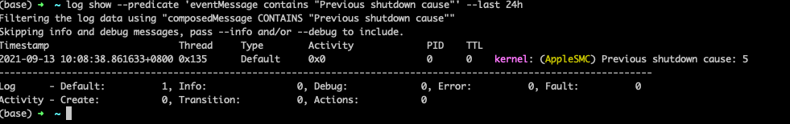

## Mac关机原因查看

### 前言

最近小伙伴遇到了`Mac`电脑合盖自动关机的问题，为了定位问题原因，发现了如下命令：

<!--more-->

### 查看关机原因命令

```shell
log show --predicate 'eventMessage contains "Previous shutdown cause"' --last 24h
```


使用上面的命令，就会列出电脑关机的时间及原因



原因就是由后面的`cause:` 5表示的

### 具体原因列表


| Code     | Description                                                  | Solution                                                     |
| :------- | :----------------------------------------------------------- | :----------------------------------------------------------- |
| **7**    | CPU thread error.                                            | If this occurs during boot, try Safe Mode by holding ⇧shift at boot to limit what opens during startup. If during application usage, see if there’s an update to the app by the developer, and leave a comment below with the name of the app and the model of your Mac. |
| **6**    | *unknown*                                                    | Have you got this error too, or any information? Leave a comment below! |
| 5        | Correct Shut Down.                                           | Shutdown was initiated normally, from the macOS Shut Down menu or other shutdown command such as `/sbin/shutdown`. This does not indicate an issue with your system. |
| 3        | Hard shutdown.                                               | Check the power button if you did not perform a hard shutdown yourself. It could be the case that the power button stuck down and forced a shutdown. |
| 0        | Power disconnected.                                          | Check power supply/battery on a laptop, or the power supply for a Mac without a battery. On a laptop, the Mac should hibernate before the battery becomes so discharged it is unable to shutdown correctly, therefore if you see this shutdown cause on a laptop it may indicate a hardware issue with the battery or with the battery controller for reading the charge. Try resetting the SMC by connecting the switched off computer to power, holding ⌃control+⌥option+⇧shift and pressing power. |
| -3       | Multiple temperature sensors exceeded the defined limit.     | Hold D on boot to run [Apple Diagnostics](https://support.apple.com/kb/HT202731) and follow the instructions if any errors are found. If the issue persists, make an appointment at an Apple Store. For Authorized Service Providers, Run Apple Service Diagnostics to check which sensor went beyond expected thermal limits. |
| **-14**  | Electricity spike/surge.                                     | On Mac Pro, this can indicate an electricity issue to the built-in power supply, or an issue with the power supply itself. |
| **-20**  | BridgeOS T2-initiated shutdown.                              | The [T2 chip](https://support.apple.com/en-us/HT208862) in your 2018+ MacBook Pro or other Mac (list in link) initiated a shutdown. |
| -60      | Bad master directory block (badMDBErr).                      | Back up your data, erase the disk and reinstall macOS. If you continue to run the system, data loss may ensue. Use [Time Machine](https://support.apple.com/kb/HT201250) to keep a backup until you are able to erase and restore. A common symptom is being [unable to repair with Disk Utility](https://apple.stackexchange.com/q/111603/37797) — as such, erasing the disk is required as mentioned. This is a very old error, from the days of Carbon. It’s unknown if this is actually relevant in macOS shutdown codes. Leave a comment below if you’ve got any more information. |
| -61      | Watchdog timer detected unresponsive application, shutting down the system. | Troubleshoot for stuck application, startup item and any loading preferences. Boot to Safe Mode by holding ⇧shift on boot which disables most startup items and daemons. If the problem does not occur, try a new user account. |
| -62      | Watchdog timer detected unresponsive application, restarting the system. | The system will automatically restart after this shutdown cause, unlike -61. Troubleshooting applies the same for cause -61. -61 is used where the system believes it cannot automatically recover, whereas -62 is used where the system determines it is likely to be resolved after restart. Hardware acceleration has been experimentally deemed a potential cause, based on kernel extensions being shown in logs. Memory management may be a potential cause, such as Google Chrome’s excessive use of RAM, which can be mitigated with various extensions that suspend tabs when not in use. While it is a bug with macOS that Google Chrome should be able to cause a -62, such mitigations might be necessary. |
| -63      | *unknown*                                                    | Some comments have indicated that this only happens with more recent Macs, such as 2018 MacBook Pros. Have you got this error too, or any information? Leave a comment below! |
| -64      | *unknown*                                                    | Have you got this error too, or any information? Leave a comment below! |
| -65      | *unknown*                                                    | Potentially linked to operating system issue. Try reinstalling macOS as fresh or booting from clean install on an external drive. |
| -71      | SO-DIMM Memory temperature exceeds limits.                   | If possible, swap memory module and check with known-good one to confirm issue is with memory. Check fans physically and with an app such as [iStat Menus](https://bjango.com/mac/istatmenus/) to determine whether the fans are rotating correctly and being reported correctly. Check air flow: open device and clean airways. |
| -74      | Battery temperature exceeds limits.                          | Reset the SMC by connecting the switched off computer to power, holding ⌃control+⌥option+⇧shift and pressing power. Swap battery and check with known-good one to confirm issue is with customer battery. |
| -75      | Communication issue with AC adapter.                         | Check power/MagSafe connector (plug), adapter and cable. Make sure the adapter in use is an official Apple power supply. On MacBook Pro with USB-C, connect power to opposite side of laptop to determine if issue is with specific ports. |
| -78      | Incorrect current value coming from AC adapter.              | Make sure the adapter is an official Apple power supply. Check AC adapter plug and cable. Confirm current at the wall where the adapter is connected to. |
| -79      | Incorrect current value coming from battery.                 | Check battery statistics: check if cycles are excessive and may indicate the battery needs replacing. Check the battery connection to logic board. |
| -86      | Proximity temperature exceeds limits.                        | Check thermal contact with heatsink, fan connection and physical/reported activity. |
| -95      | CPU temperature exceeds limits.                              | Check thermal contact with heatsink, fans. Reset SMC by connecting the switched off computer to power, holding ⌃control+⌥option+⇧shift and pressing power. |
| -100     | Power supply temperature exceeds limits.                     | Check fans and air flow. Confirm power supply is official Apple. If MagSafe, remove any MagSafe adapters in use (e.g. MagSafe 1 to 2). |
| **-102** | Overvoltage                                                  | Safety shutdown related to over voltage protection (MLB or Battery). |
| -103     | Battery cell under voltage detected.                         | Check battery and replace with known-good. Perform one charge cycle, then try again. |
| -104     | *unknown*                                                    | Possibly linked to battery issue. Perform one charge cycle and try D-boot to run diagnostics. |
| -108     | *unverified*                                                 | Likely memory issue. Commonly occurs when RAM is full and there was an issue with paging. Can occur when the system is sleeping. |
| -112     | *unverified*                                                 | Memory issue. Almost always occurs around -128, another memory issue. Almost certainly hardware fault. See -128 for troubleshooting. |
| -127     | PMU forced shutdown.                                         | Check power button on your hardware. Potentially fine if you forced shutdown, otherwise may be hardware/SMC issue. |
| -128     | *unknown*                                                    | Possibly linked to memory issue. If the issue is persistent, try replacing the RAM with known-good if your hardware has removable RAM. |


内容来源： https://georgegarside.com/blog/macos/shutdown-causes/
