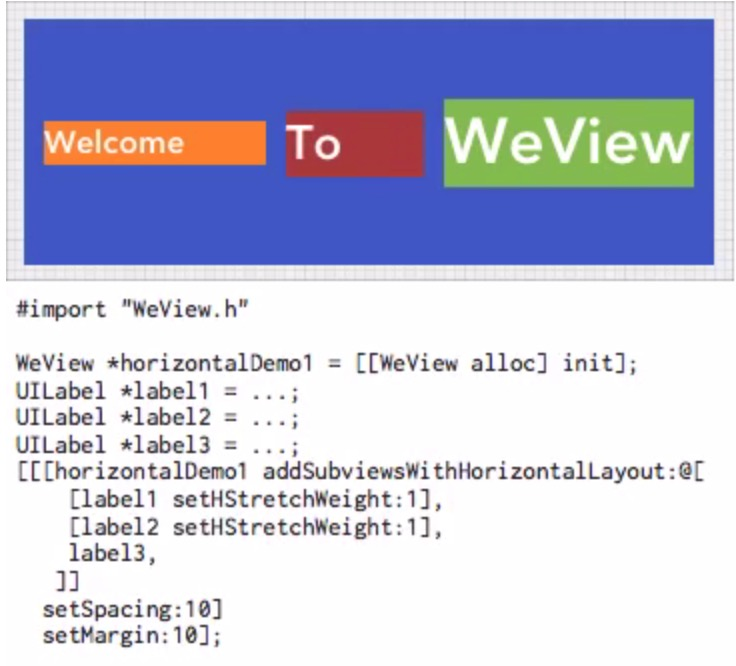

 # WeView 介绍 #
 
 ## WeView 使用的一个简单的demo ##
 
 
 
 > WeView 是一个用来给iOS界面自动布局的工具库
 
 * WeView 2是iOS Auto Layout 的替代品.
 * WeView 2旨在提供一个"简单","自然","易描述","易维护"的方法通过UIKit去创建动态适应的界面
 * WeView 2使用直观的描述性方法来布局,如"alignment"(对齐),"margins"(边距),"spacing" (间距).
 * WeView 2构建在iOS现有的大小和布局机制.
 * WeView 2是轻量级的:不超过5k行代码而且没有别的依赖.
 * WeView 2兼容iOS5及以上版本.
 * WeView 2是免费开源的,遵循" Apache License Version 2.0"
 * WeView 2是易学的.
 
# 为什么使用动态布局 #

> 使用动态布局的原因有很多,不管你使用的是iOS Auto Layout还是WeView.动态布局会让界面做到如下几点:

1. 适应不同的屏幕尺寸
2. 适应方向的改变(eg:横屏和竖屏)
3. 适应设计的改变(eg:字体大小的改变,添加或移除子view,改变图片大小等)
4. 适应文本内容的改变
5. 适应动态内容的改变(eg:下载完成的内容)

# 为什么使用WeView 2 #

> 摘要: iOS Auto Layout 是一种复杂笨拙效率低下的编码方式

* 概念复杂:在使用iOS Auto Layout的时候,你需要考虑"约束优先级","约束是否完全","约束是否冲突"(eg:过约束布局),"最近共同祖先"等,这些问题也使代码重构变的复杂
* 缺乏基准:iOS Auto Layout 是基于一个复杂的约束处理系统,任何view的最终位置和大小都会收受到约束系统中的所有约束的影响,这些约束不需要被他们的父view持有,如果不能理解相邻view的层级就不能进行约束
* 编码复杂:用iOS Auto Layout布局一个按钮水平居中,底部距离父view20pt

## iOS Auto Layout 代码 ##

```
UIButton *button = ...;
UIView *superview = ...;
NSLayoutConstraint *cn = [NSLayoutConstraint constraintWithItem:button
                                                      attribute:NSLayoutAttributeCenterX
                                                      relatedBy:NSLayoutRelationEqual
                                                         toItem:superview
                                                      attribute:NSLayoutAttributeCenterX
                                                     multiplier:1.0
                                                       constant:0.0];
[superview addConstraint:cn];
cn = [NSLayoutConstraint constraintWithItem:button
                                  attribute:NSLayoutAttributeBottom
                                  relatedBy:NSLayoutRelationEqual
                                     toItem:superview
                                  attribute:NSLayoutAttributeBottom
                                 multiplier:1.0
                                   constant:-20.0];
[superview addConstraint:cn];
```

## 使用Visual Format Language的Auto Layout ##

```
UIButton *button = ...;
UIView *superview = ...;
NSDictionary *variableMap = NSDictionaryOfVariableBindings(label, superview);
NSLayoutConstraint *cn = [NSLayoutConstraint constraintsWithVisualFormat:@"V:[button]-12-[superview]"
                                                                 options:0
                                                                 metrics:nil
                                                                   views:variableMap];
[superview addConstraint:cn];
cn = [NSLayoutConstraint constraintsWithVisualFormat:@"H:[superview]-(<=1)-[button]"
                                             options:NSLayoutFormatAlignAllCenterY
                                             metrics:nil
                                               views:variableMap];
[superview addConstraint:cn];
```

## 使用WeView ##

```
#import "WeView.h"

UIButton *button = ...; 
WeView *panelView = [[WeView alloc] init]; 
[[[[panelView addSubviewWithCustomLayout:button]
   setHAlign:H_ALIGN_CENTER]
  setVAlign:V_ALIGN_BOTTOM]
setMargin:20];
```

iOS Auto Layout 在xib中比较有优势,而且xib已经在Xcode5中被显著提高,但是在代码编程中自动布局还是很复杂的

WeView 只能被用作代码编程,但可以被设计的简洁明了,利于维护的代码


# 指导 1: 概述 #

略

# 指导 2: 安装 #

添加WeView文件夹到工程中就好.

WeView 2只依赖Foundation ,UIKit 和 Quartz Core库而且需要iOS 5及以上版本

## Headers ##

头文件通常只需要导入 ```#import "WeView.h" ```

## Classes ##

* ```WeView``` 容器是核心类,他本身只有添加子view和他们布局的方法
* ```WeView``` 的布局是由WeViewLayout实现的
* ```UIView + WeView``` 类别为UIView添加了许多布局属性,用来控制view怎么作为子view布局在他的父view上,这些属性存放在一个关联的对象中,且这个对象只有一个

# 指导 3:术语 #

## View Hierarchy (图层) ##

图层是布局作用的上下文,通常我们只需要关系我们布局view的子view和父view

## Superview & Subviews (父view和子view) ##

在布局上下文中,Superview是父view,而他的子view是Subviews(注意:Superview只有一个但是Subviews是可以有多个的),在使用WeView 2布局的时候,通常父view是一个```WeView```,子View可以是任何类型的UIView

WeView 2工作的时候子View不需要引用任何类或实现任何界面

## Widgets vs. Containers (控件和容器) ##

widgets(控件) :一个界面上可见的元素 eg:button或label等

containers(容器) :通常是一些不可见的view,用来组织结构和布局其他view eg:在HTML中DIVs通常被用作容器,在UIKit中,空白view也通常被使用.WeView 2的核心就是```WeView```容器类,通过给容器添加子view作为内容

## Measurement and Arrangement ##

Measurement :是view的size推测位置的过程
eg:measurement 类似于```[UIView sizeThatFies:]```方法

Arrangement :是view的size决定位置的过程
eg:arrangement 类似于```[UIView layoutSubviews]```方法

## Desired Size ##

有时候view想要一个他们想要的大小.eg:一个button想要大小是icon的大小,或label想要大小是文本的大小.这时候的大小就是view的Desired Size

使用Weview 2的时候我们可以完全放心的忽视 intrinsic size(固有大小)


## Frame and Bounds ##

UIViews 使用了两套坐标系统.
frame :UIView的frame是他在他父view的坐标系统中的大小和位置
bounds :UIView的bounds是他在他自己的坐标系统中的大小和位置

布局子view的时候是在他的父view的坐标系中操作的,所以操作的是子view的frame.

改变一个view的frame会影响他的bounds,反之也是一样的


 